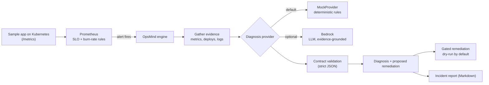

# OpsMind


-FF9900?logo=amazonaws&logoColor=white)


**An AI-assisted incident-response and gated self-healing agent for Kubernetes.**

When an SLO-based alert fires, OpsMind gathers the deterministic evidence (breached
metrics, recent deploys, logs), asks a diagnosis provider what is probably wrong, and
proposes a scoped remediation. The AI is only ever given the pre-computed evidence, its
answer must pass a strict machine-checked contract before it is used, and remediations
are **dry-run by default** and never execute without an explicit, risk-capped opt-in.

> Honesty note: this is a lab/portfolio system. The end-to-end demo runs on a local
> `kind` cluster with a sample workload and **simulated** (injected) incidents. It does
> not claim production scale.

---

## Why this design

Applying an LLM to operations is risky if the model can hallucinate actions. OpsMind
borrows the safety pattern from its sibling project
[DriftMind](https://github.com/Extraordinarytechy/driftmind): compute the evidence
deterministically first, hand the model only that structured evidence, and **validate
the response against a contract** before anything acts on it. The model interprets; it
does not get to invent state or fire arbitrary commands.

## Architecture



## Safety model (the important part)

- **Evidence-grounded:** the provider receives only structured evidence, never free text.
- **Contract-checked:** every response must pass `contract.parse_diagnosis` (required
  fields, confidence in `0..1`, and an **allow-listed** action) or it is rejected.
- **Dry-run by default:** `apply_remediations` performs nothing unless `allow_execute=True`.
- **Risk-capped + allow-listed:** even when execution is enabled, only auto-allowed
  actions within a configured `max_risk` run; everything else is escalated to a human.

## Quick start (no cluster, no cost)

The engine and its tests run with the Python standard library only.

```bash
# run the test suite (14 tests)
python3 -m unittest discover -s tests -v

# diagnose the bundled sample incident
python3 -m opsmind.cli examples/sample_alert.json
```

Example output (mock provider, dry-run):

```
# Incident Report: HighErrorRate
...
## Probable cause
A recent deployment (deploy/payments@v2.4.1) likely introduced a regression.
## Proposed remediations
- [PROPOSED (dry-run)] rollback_deployment -> deploy/payments@v2.4.1 (risk: warning, reversible: True)
```

## Full loop on a local cluster (kind)

```bash
make cluster        # kind create cluster
# install kube-prometheus-stack (Prometheus + Grafana) via Helm, then:
docker build -t opsmind/sample-app:dev deploy/sample-app
kind load docker-image opsmind/sample-app:dev --name opsmind
make deploy         # app + servicemonitor + SLO rules
make failure        # inject errors -> SLO breach -> alert
python3 -m opsmind.cli examples/sample_alert.json   # diagnose
```

## Using Amazon Bedrock (optional)

```bash
pip install boto3
export AWS_REGION=us-east-1
python3 -m opsmind.cli examples/sample_alert.json --provider bedrock
```

The Bedrock provider is imported lazily, so `boto3` is only needed when you select it.
The same contract validation applies to the model's output.

## Repository layout

```
opsmind/
├── opsmind/                 # the engine (stdlib only)
│   ├── models.py            # Evidence, Diagnosis, Remediation
│   ├── contract.py          # strict validation of provider output
│   ├── engine.py            # evidence -> provider -> validated diagnosis
│   ├── report.py            # incident report renderer
│   ├── remediation.py       # gated, risk-capped remediation
│   ├── cli.py               # python -m opsmind.cli <evidence.json>
│   └── providers/           # base + mock (default) + bedrock (optional)
├── deploy/
│   ├── sample-app/          # tiny FastAPI workload (/metrics, /chaos)
│   ├── app/                 # k8s Deployment, Service, ServiceMonitor
│   ├── monitoring/          # SLO + burn-rate PrometheusRule
│   └── kind-cluster.yaml
├── scripts/inject_failure.sh
├── tests/                   # 14 unit tests (unittest)
└── examples/sample_alert.json
```

## Roadmap

- Grafana dashboards tied to the SLOs, committed as JSON.
- ArgoCD app-of-apps so the whole stack is GitOps-managed.
- A real (kubectl) executor behind the gated remediation interface.
- Post-incident review notes generated from each run.

## Author

**Ajay Kumar** — Cloud & DevOps Engineer · AWS Community Builder (Cloud Operations)
[GitHub](https://github.com/Extraordinarytechy) · [LinkedIn](https://linkedin.com/in/extraordinarytechy)

## License

[MIT](./LICENSE)
